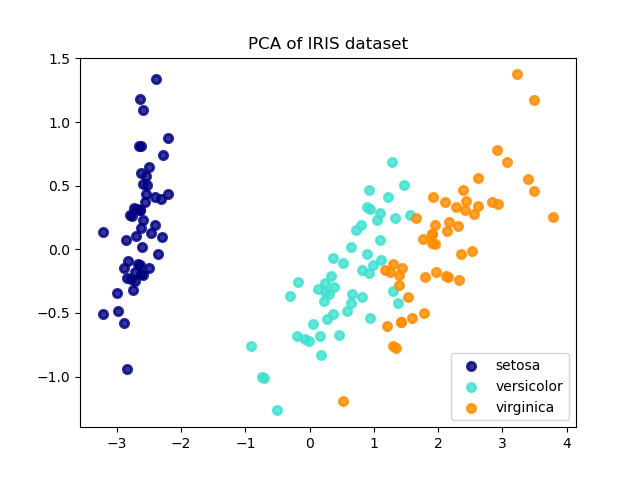

# Iris_Django_ML_Project_Online_Postgresql

Aim :
Build a ML enabled D1jango app to predict iris flower species from a user input

Objectives :
Build & Train a model to classify different species of Iris flowers
Build app to take input from a user and return predictions 

Steps Involved :
1. Display Iris dataset
2. Supervised learning on Iris dataset
3. Loading the Iris dataset into scikit-learn
4. Machine learning terminology
5. Exploring the Iris dataset
6. Requirements for working with datasets in scikit-learn
7. Additional resources

Skills Used In this Project :
1) Django
2) numpy
3) pandas
4) psycopg2
5) scikit-learn
6) scipy
7) Ajax

In this Project We Will Use Iris Dataset ["https://archive.ics.uci.edu/ml/machine-learning-databases/iris/iris.data"]
To train our model and after training it , We will Take Data from User 

User Input :
1) Sepal Length
2) Sepal Width
3) Petal Length
4) Petal Width

After Taking the users Input , ML Algorithm will predict the following type of 
Iris-setosa
Iris-versicolor
Iris-virginica

For Machine Learning Part refer this .ipynb file
https://github.com/shankFabWork/Iris_Django_ML_Project_Online_Postgresql/blob/master/Iris.ipynb

Principal Component Analysis (PCA) =>
PCA is an unsupervised statistical technique that is used to reduce the dimensions of the dataset. 
ML models with many input variables or higher dimensionality tend to fail when operating on a higher input dataset.

